# DreamHouse Management System

## Project Description

DreamHouse Management System is a Laravel-based web application developed for managing rental property operations efficiently. The system handles property management, renters, leases, payments, staff, branches, inspections, advertisements, and report generation through an integrated dashboard interface.

The project follows the Laravel MVC architecture and uses MySQL as its relational database management system.

---

# Team Members

| Name                   | Role                                                                  |
|------------------------|-----------------------------------------------------------------------|
| Vanley John B. Monares | Project Controllers / Reports / Integration / Ads / Staff / Analytics |
| Vanessa S. Dajang      | Property Module / Lease Module / Viewing list / Inspections           |
| Allen Literato         | Renter Module  / Payment Module / Owners / Branches                   |

---

# Tech Stack

- Laravel 12
- PHP 8
- MySQL (HeidiSQL)
- Blade Templates
- Bootstrap / Custom CSS
- GitHub
- Railway

---

# Features

## Authentication System

- User login system
- Session handling
- Role-based access

---

# Core Modules

## Dashboard
- Centralized navigation
- System overview

## Branch Management
- Add branch records
- Edit branch details
- Delete branch records
- Search branch information

## Staff Management
- Add staff records
- Update staff details
- Remove staff records
- View employee information

## Property Management
- Property listing management
- Rent information handling
- Property type categorization

## Renter Management
- Manage renter records
- Store contact information
- Preferred property type handling

## Lease Management
- Lease contract records
- Rental tracking
- Deposit tracking
- Lease period management

## Payment Management
- Payment recording
- Revenue tracking
- Payment method tracking
- Payment status monitoring

## Inspection Management
- Property inspection records
- Inspection scheduling

## Advertisement Management
- Advertisement tracking
- Property promotion handling

## Viewing Management
- Property viewing schedules
- Viewing record management

---

# Analytics & Reports

The system contains dedicated printable reporting modules:

- Lease Report
- Payment Report
- Property Report
- Renter Report
- Staff Report

## Report Features

- Dynamic database-generated reports
- Real-time statistics
- Revenue summaries
- Average calculations
- Printable layouts
- Clean dashboard navigation

---

# System Architecture

The project follows Laravel MVC architecture.

| Component | Purpose |
|---|---|
| Models | Database interaction |
| Views | Blade templates and UI |
| Controllers | Business logic |
| Routes | URL and navigation handling |

---

# Database Information

## Database Platform

```txt
MySQL (XAMPP / Railway)
```

---

# Main Tables

| Table | Purpose |
|---|---|
| branch | Branch records |
| staff | Staff management |
| property | Property records |
| renter | Renter management |
| lease | Lease transactions |
| payment | Payment records |
| inspection | Inspection schedules |
| viewing | Viewing schedules |
| advertisement | Advertisement records |

---

# Foreign Key Integrity

The system uses foreign key relationships to maintain database integrity.

- A lease cannot reference a non-existent renter
- Payments cannot exist without valid lease records
- Records connected to other tables are protected from accidental deletion

---

# Installation Guide

## Clone Repository

```bash
git clone https://github.com/YOUR-USERNAME/Dreamhouse-Laravel.git
```

---

# Enter Project Folder

```bash
cd Dreamhouse-Laravel
```

---

# Install Dependencies

```bash
composer install
npm install
```

---

# Configure Environment File

```bash
cp .env.example .env
```

---

# Generate Application Key

```bash
php artisan key:generate
```

---

# Database Configuration

Update your `.env` file:

```env
DB_CONNECTION=mysql
DB_HOST=127.0.0.1
DB_PORT=3306
DB_DATABASE=dreamhome_db
DB_USERNAME=root
DB_PASSWORD=
```

---

# Run Database Migration

```bash
php artisan migrate
```

---

# Run Seeder (Optional)

```bash
php artisan db:seed
```

---

# Start Laravel Server

```bash
php artisan serve
```

---

# Start Vite

```bash
npm run dev
```

---

# Local Development URL

```txt
http://127.0.0.1:8000
```

---

# Report Routes

| Report | Route |
|---|---|
| Lease Report | `/reports/lease` |
| Payment Report | `/reports/payment` |
| Property Report | `/reports/property` |
| Renter Report | `/reports/renter` |
| Staff Report | `/reports/staff` |

---

# Controllers Used

## Main Controllers

- AuthController
- BranchController
- StaffController
- PropertyController
- RenterController
- LeaseController
- PaymentController
- InspectionController
- ViewingController
- AdsController
- ReportController
- AnalyticController

---

# Report System Structure

The reporting system uses:
- `ReportController.php`
- Laravel Routes (`web.php`)
- Blade Templates
- MySQL Queries through Laravel DB facade

Example:

```php
Route::get('/reports/property',
[ReportController::class, 'property']);
```

---

# Printable Reports

All reports support browser printing through:

```javascript
window.print()
```

Features include:
- Clean print formatting
- Statistical summaries
- Database-generated tables
- Responsive print layout

---

# Git Branch Strategy

| Branch | Purpose |
|---|---|
| main | Stable production-ready build |
| dev | Testing and integration |
| feature-module-name | Individual module development |

---

# Deployment

## Deployment Platform

```txt
Railway
```

---

# Deployment Status

```txt
Ready for Deployment
```

---

# Testing Checklist

- CRUD functionality
- Authentication system
- Session handling
- Database connectivity
- Foreign key integrity
- Report generation
- Print functionality
- Responsive UI
- Route accessibility

---

---

# Notes

- The system uses Laravel Blade templates
- Reports dynamically retrieve data from MySQL tables
- Database relationships are protected using foreign keys
- Analytics modules generate printable summaries from live database records

---

# Repository Link

```txt
https://github.com/YOUR-USERNAME/Dreamhouse-Laravel
```

---

# Final Remarks

DreamHouse Management System was developed as a complete rental property management solution using Laravel and MySQL with integrated reporting and deployment preparation through Railway.

# Screenshots Required

- Login Page
  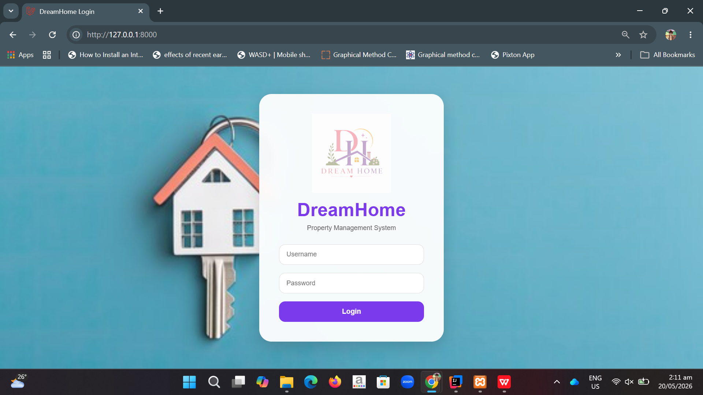
- Dashboard
  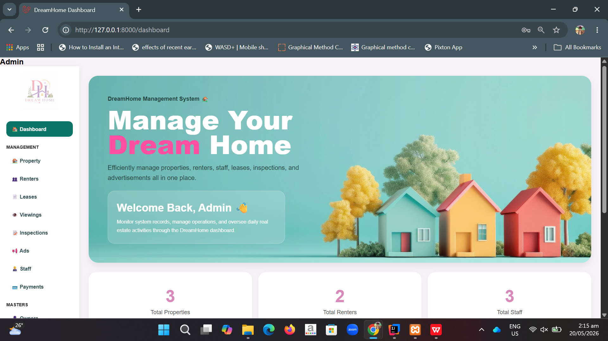
- CRUD Modules
  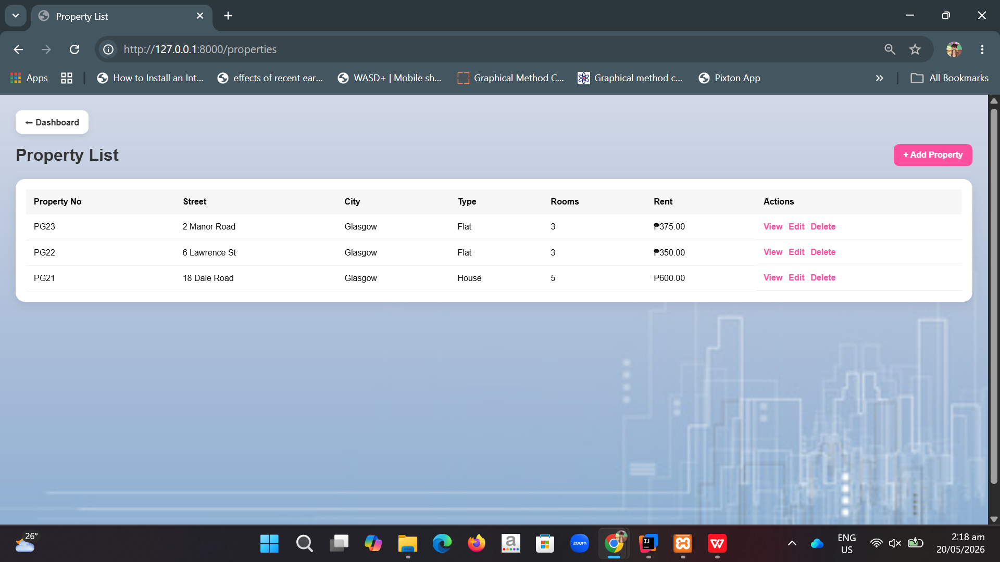
  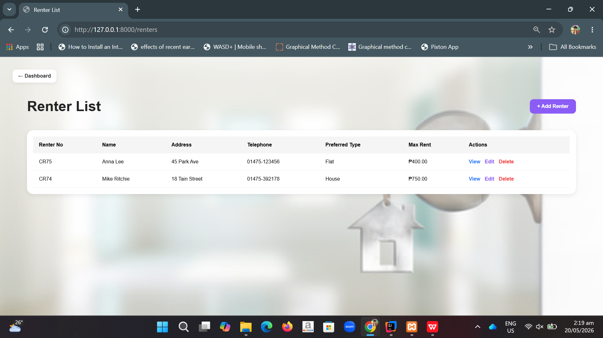
  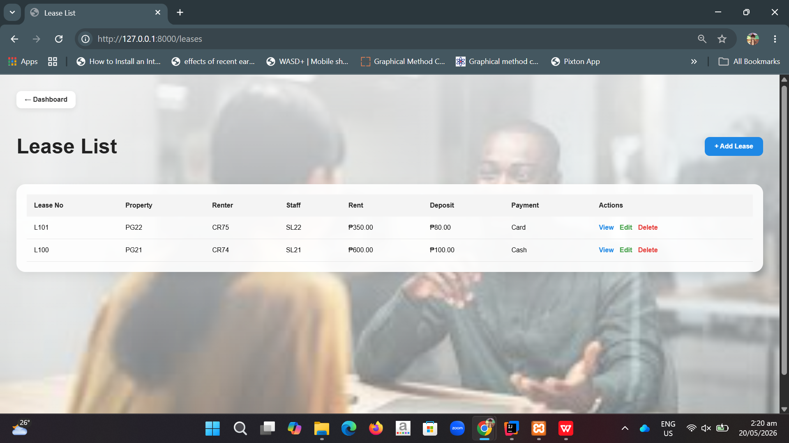
  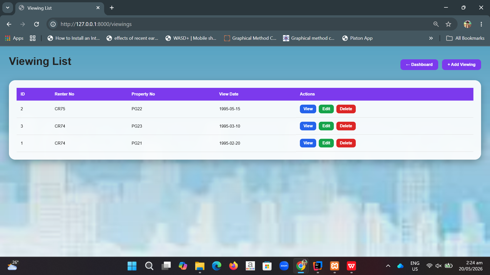
  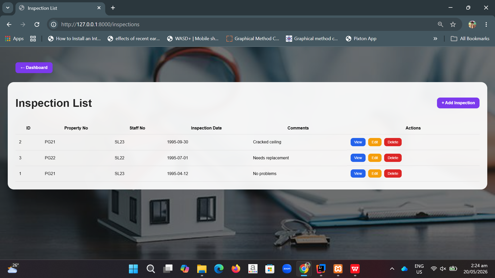
  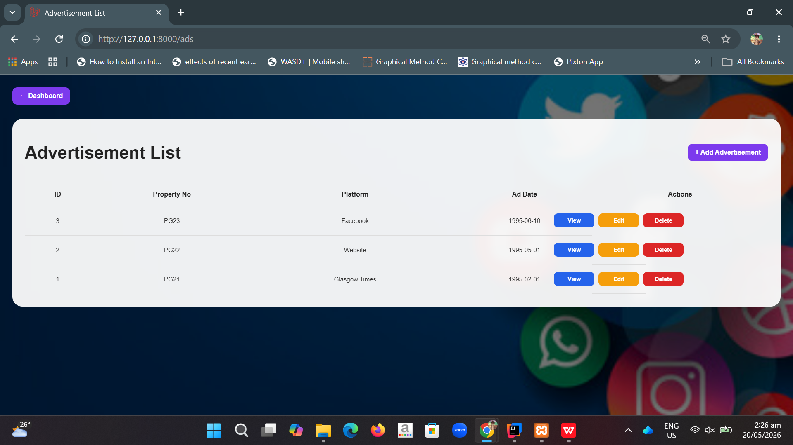
  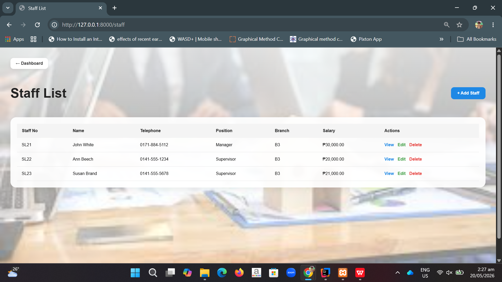
  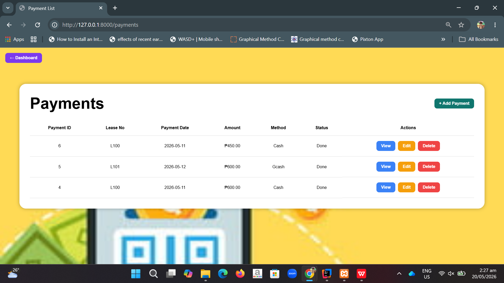
  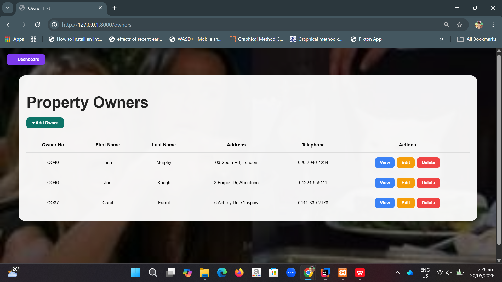
  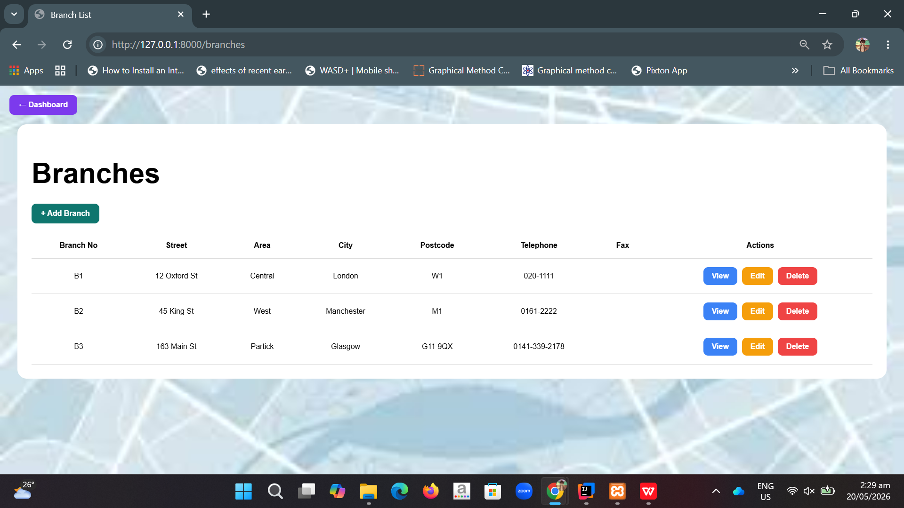
- Reports
  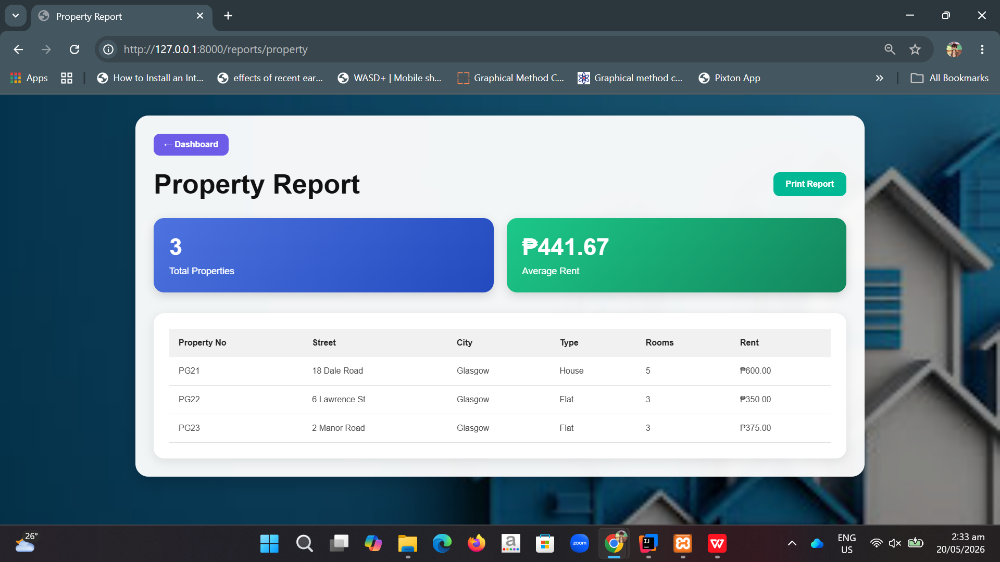
  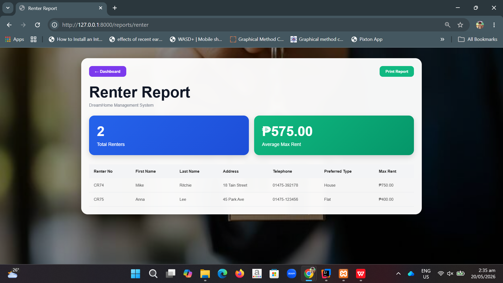
  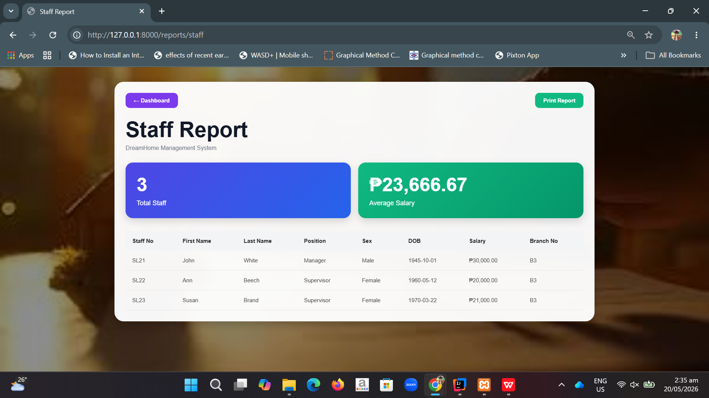
  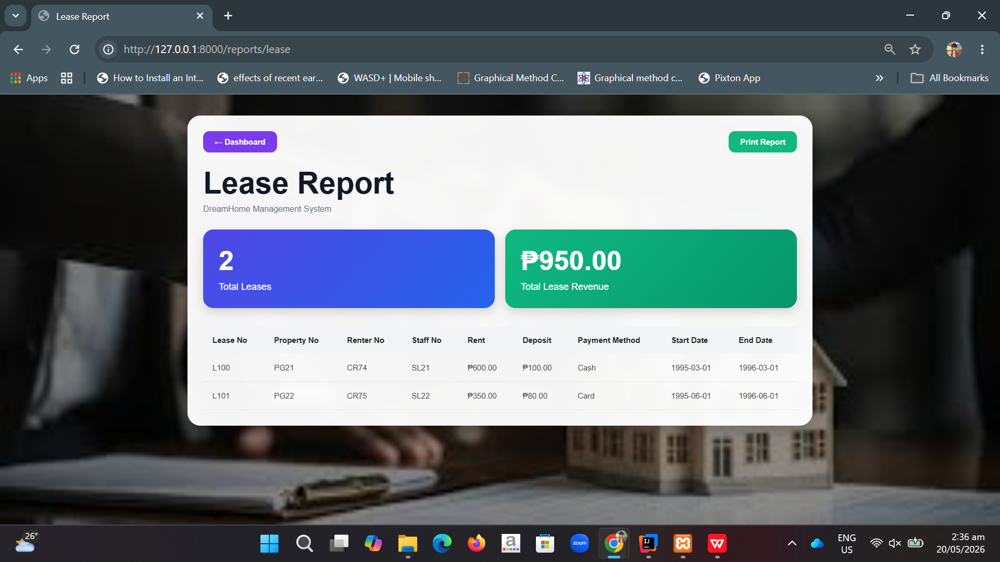
  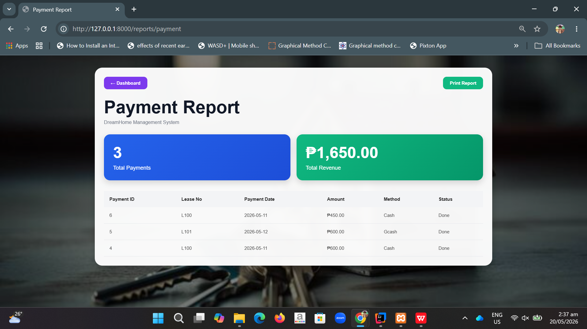
- MySQL (XAMMP) Database Tables
  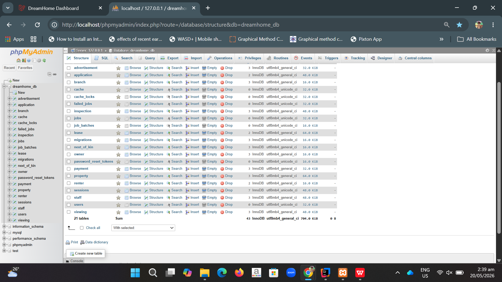

